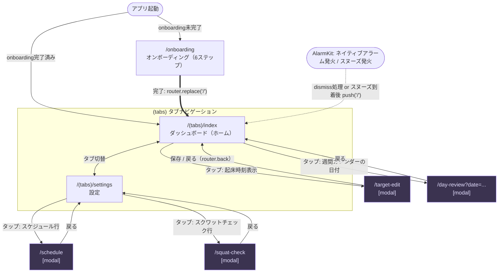

# UI マップ

タスクベースの起床フローを持つ iOS アラームアプリの画面構成・遷移・コンポーネント構成をまとめる。

## 概要

Good Morning は、アラーム解除後に朝のタスク（固定のスクワット 10 回）をこなすことで一日を始める、タスクベース起床フロー型の iOS アラームアプリ。Expo Router（file-based routing）+ Zustand（状態管理）+ Expo Notifications/AlarmKit（ネイティブアラーム）で構成され、ダークテーマ・日本語/英語 i18n（`src/i18n/locales/{ja,en}`）に対応する。

本ドキュメントはコード（`app/` 配下 9 画面、`src/components/` 配下 21 コンポーネント）を直接読んで作成したもの。画面構成やナビロジックに大きな変更が入った場合は、このドキュメントも合わせて更新すること。

## 画面遷移図

凡例:
- 実線 (`-->`) = `router.push`。太線 (`==>`) = `router.replace`（戻れない遷移）。点線 (`-.->`) = アプリ内タップ操作ではなく、ネイティブ側（AlarmKit）のイベント起点で発火する遷移。
- 紫色のノード（target-edit / schedule / day-review / squat-check）は `presentation: 'modal'` で開くモーダル画面。

## 画面一覧

### 1. `app/_layout.tsx` — ルートレイアウト

Expo Router のルート `Stack`。全ストア（wake-target, wake-record, morning-session, settings, daily-grade）の初回ロード、バックグラウンド同期の登録、AlarmKit 権限確認、コールドスタート/フォアグラウンド復帰時のアラームイベント処理（`handleAlarmEventEffect`）を担う。画面そのものは持たず、`onboarding` / `(tabs)` / `target-edit` / `schedule` / `day-review` / `squat-check` の 6 つの `Stack.Screen` を登録し、後者 4 つに `presentation: 'modal'` を指定する。

- **入り口**: アプリ起動時に必ずマウントされる（他画面の親）。
- **遷移**: `onboardingCompleted` フラグが `'true'` でなければ `router.replace('/onboarding')`。AlarmKit のアラーム/スヌーズイベントを検知すると `router.push('/')` でダッシュボードへ。

### 2. `app/(tabs)/_layout.tsx` — タブレイアウト

`Tabs`（ホーム/設定の 2 タブ）。Web 以外では `BottomTabBar` の上に `MorningRoutineBanner` を重ねたカスタム `tabBar` を使用する（`BottomTabView` が要求する `FrameSizeProvider` 配下で呼び出す必要があるため、`@react-navigation/elements` のバージョン重複をテストで検知している）。

- **入り口**: onboarding 完了後の初期ルート。ダッシュボードまたは設定への画面遷移では戻らない（タブなので並列に存在）。
- **遷移**: `index`（ホーム）⇔ `settings`（設定）のタブ切替のみ。

### 3. `/(tabs)/index` (`app/(tabs)/index.tsx`) — ダッシュボード（ホーム）

アプリのメイン画面。朝のセッションが非アクティブなら「明日の起床目標時刻・目標睡眠時間・起床目標バッファ・固定タスク表示」を、アクティブなら「進捗バー・目標/スヌーズカウントダウン・TODO チェックリスト（またはスクワットチャレンジ）」を表示する。加えてストリークバッジ・週間カレンダー・睡眠サマリー・週間統計を表示する。

- **入り口**: タブ切替、onboarding 完了後の `router.replace('/')`、AlarmKit イベント処理後の `router.push('/')`、`MorningRoutineBanner` タップ時の `router.navigate('/')`。
- **遷移**: 起床時刻表示タップ → `target-edit`（push）。週間カレンダーの日付タップ → `day-review?date=YYYY-MM-DD`（push）。

### 4. `/(tabs)/settings` (`app/(tabs)/settings.tsx`) — 設定

スケジュール画面への導線、アラーム有効/無効スイッチ、日付変更ライン（`DayBoundaryPicker`）、スクワットチェック画面への導線、権限一覧（通知・HealthKit・AlarmKit など、`APP_PERMISSIONS` ベース）、バージョン情報を表示する。

- **入り口**: タブ切替。
- **遷移**: 「スケジュール」行タップ → `schedule`（push）。「スクワットチェック」行タップ → `squat-check`（push）。

### 5. `/onboarding` (`app/onboarding.tsx`) — オンボーディング

初回起動時のみ表示される 6 ステップのウィザード（`welcome → time → todos → permission → confirm → demo`）。画面遷移ではなく内部の `step` state でステップを切り替える単一ルート。完了時に `WakeTarget` を保存し `STORAGE_KEYS.onboardingCompleted` を `'true'` にする。

- **入り口**: ルートレイアウトが `onboardingCompleted` 未設定を検知した時の `router.replace('/onboarding')` のみ。
- **遷移**: 最終ステップ完了 → `router.replace('/')` でダッシュボードへ（戻るナビゲーションスタックには残らない）。

### 6. `/target-edit` (`app/target-edit.tsx`) — 起床時刻編集（モーダル）

翌日の起床時刻を時/分の矢印ピッカーで編集するモーダル。「明日だけ変更」（`nextOverride`）か「デフォルトを変更」（`defaultTime` 更新）かをラジオボタンで選択して保存する。

- **入り口**: ダッシュボードの起床時刻表示タップ。
- **遷移**: 保存ボタン → 該当ストア更新後 `router.back()` でダッシュボードへ。

### 7. `/schedule` (`app/schedule.tsx`) — 週間スケジュール（モーダル）

曜日ごとに `default`（デフォルト時刻を使用）/ `custom`（個別時刻）/ `off`（その曜日はアラームなし）を 3 択セグメントで切り替えるモーダル。`custom` 選択時はインラインの時刻ピッカーが展開する。

- **入り口**: 設定画面の「スケジュール」行タップ。
- **遷移**: モーダルのため戻る操作（ヘッダー戻る/スワイプ）で設定画面へ。画面内に明示的な保存ボタンはなく、各操作が即座にストアへ反映される。

### 8. `/squat-check` (`app/squat-check.tsx`) — スクワット検出チェック（モーダル）

本番の朝のフローとまったく同じ `SquatChallengeItem` コンポーネントを使い、朝のフローを発火させずにスクワット検出の挙動を確認できる開発者向け動作確認画面。加速度・ジャイロ・磁気・気圧センサーと歩数のリアルタイム値もデバッグセクションに表示する。

- **入り口**: 設定画面の「スクワットチェック」行タップのみ。実際の朝のフロー（アラーム解除後）とは独立している。
- **遷移**: リセットボタンで検出状態のみ初期化。画面遷移は戻る操作で設定画面へ。

### 9. `/day-review` (`app/day-review.tsx`) — 日次レビュー（モーダル）

`date`（`YYYY-MM-DD`）クエリパラメータで指定した日の起床結果（結果バッジ・目標/実際の時刻・TODO 完了状況）、睡眠データ（`SleepDetailSection`）、Daily Grade（朝/夜 2 軸評価 + ストリーク、`DailyGradeSection`）を表示する。`WakeRecord` も `DailyGradeRecord` も存在しない日は「記録なし」を表示する。

- **入り口**: ダッシュボードの週間カレンダーの日付タップのみ（`date` パラメータ必須）。
- **遷移**: 戻る操作でダッシュボードへ。

## コンポーネント一覧

### ルート直下 (`src/components/*.tsx`)

| コンポーネント | ファイル | 概要 | 主な props |
|---|---|---|---|
| DayBoundaryPicker | `src/components/DayBoundaryPicker.tsx` | 日付変更ライン（0〜23時）を選ぶボトムシート風モーダルピッカー | `value: number`, `onValueChange: (value) => void` |
| MorningRoutineBanner | `src/components/MorningRoutineBanner.tsx` | アクティブなセッションがある時のみタブバー上部に進捗バナーを表示、タップでダッシュボードへ | props なし（ストア直結） |
| ProgressBar | `src/components/ProgressBar.tsx` | トラック + 塗りのみのプレゼンテーショナルな進捗バー | `ratio: number`, `height: number`, `trackColor?`, `fillColor?` |
| SleepDurationCard | `src/components/SleepDurationCard.tsx` | 目標睡眠時間と逆算した就寝目標時刻を表示、タップで `SleepDurationPickerModal` を開く | `alarmTime`, `targetSleepMinutes`, `onSleepMinutesChange` |
| SleepDurationPickerModal | `src/components/SleepDurationPickerModal.tsx` | 5h〜10h（30分刻み）から目標睡眠時間を選ぶボトムシートモーダル | `visible`, `currentValue`, `onSave`, `onClose` |
| SquatChallengeItem | `src/components/SquatChallengeItem.tsx` | 加速度センサーでスクワット動作を検出するプログレスリング付きチャレンジ UI | `todo: SessionTodo`, `onIncrement`, `onComplete` |
| TodoListItem | `src/components/TodoListItem.tsx` | チェックボックス付き TODO 行（`editable` 時はタイトル編集・削除も可） | `item`, `onToggle`, `editable?`, `onChangeTitle?`, `onDelete?` |

### `onboarding/`

| コンポーネント | ファイル | 概要 | 主な props |
|---|---|---|---|
| ConfirmStep | `src/components/onboarding/ConfirmStep.tsx` | オンボーディング 5 番目のステップ。アラーム有効/無効を確認 | `onConfirm: (enabled) => void`, `onBack` |
| DemoStep | `src/components/onboarding/DemoStep.tsx` | オンボーディング最終ステップ（旧: 独自 wakeup 画面のデモ→現在は説明のみ） | `onNext`, `onBack` |
| PermissionStep | `src/components/onboarding/PermissionStep.tsx` | `APP_PERMISSIONS` を一覧表示し個別に許可をリクエスト。必須権限が揃うまで「次へ」を無効化 | `onNext`, `onBack` |
| StepButton | `src/components/onboarding/StepButton.tsx` | オンボーディング共通の primary/secondary ボタン | `label`, `onPress`, `variant`, `flex?`, `disabled?`, `style?` |
| StepHeader | `src/components/onboarding/StepHeader.tsx` | オンボーディング共通のタイトル + サブタイトルヘッダー | `title`, `subtitle` |
| TimeStep | `src/components/onboarding/TimeStep.tsx` | デフォルト起床時刻を時/分別のスクロールピッカーで設定 | `onNext`, `onBack`, `time`, `setTime` |
| TodosStep | `src/components/onboarding/TodosStep.tsx` | 固定スクワットタスクの説明ステップ（自由入力 UI は廃止済み） | `onNext`, `onBack` |
| WelcomeStep | `src/components/onboarding/WelcomeStep.tsx` | 最初のウェルカム画面 | `onNext` |

### `grade/`

| コンポーネント | ファイル | 概要 | 主な props |
|---|---|---|---|
| DailyGradeSection | `src/components/grade/DailyGradeSection.tsx` | 日次レビュー用。朝/夜 2 軸判定 + ストリークをまとめて表示 | `gradeRecord: DailyGradeRecord \| undefined`, `streak: StreakState` |
| GradeIcon | `src/components/grade/GradeIcon.tsx` | `DailyGrade` を1文字記号（◎○△×）+ 色で表示 | `grade: DailyGrade \| null`, `size?` |
| StreakBadge | `src/components/grade/StreakBadge.tsx` | 連続達成日数とフリーズ残数のバッジ | `currentStreak`, `freezesAvailable` |

### `sleep/`

| コンポーネント | ファイル | 概要 | 主な props |
|---|---|---|---|
| SleepCard | `src/components/sleep/SleepCard.tsx` | ダッシュボード用の睡眠サマリーカード（HealthKit 未連携時は接続ボタンを表示） | `summary: DailySummary` |
| SleepDetailSection | `src/components/sleep/SleepDetailSection.tsx` | 日次レビュー用の睡眠詳細セクション（HealthKit 未連携時は非表示） | `summary: DailySummary` |
| SleepTimelineBar | `src/components/sleep/SleepTimelineBar.tsx` | 就寝〜起床の時間帯を SVG バーで可視化（目標時刻・実 dismiss 時刻マーカー付き） | `bedtime`, `wakeTime`, `targetTime`, `dismissedAt`, `compact?` |

## 既知の構造上の注意点

- ルート `Stack`（`app/_layout.tsx`）に登録されたサブ画面はすべて `presentation: 'modal'`（`target-edit` / `schedule` / `day-review` / `squat-check`）。カードプッシュで開くサブ画面は存在しない。`onboarding` と `(tabs)` はデフォルトのカード表示だが、前者は `router.replace` でしか到達しないため実質「戻れない」画面。
- `app/` 配下・`src/components/` 配下のいずれにも `<Link>` / `<Redirect>` は使われていない（grep で確認済み）。画面遷移はすべて `useRouter()` の `push` / `replace` / `back` / `navigate` による命令的な呼び出し。
- オンボーディングは一方向のフロー。到達経路はルートレイアウトが `AsyncStorage` の `onboardingCompleted` 未設定を検知したときの `router.replace('/onboarding')` のみで、設定画面などアプリ内に「オンボーディングをやり直す」導線は存在しない。
- 専用の「アラーム発火中」画面（旧 `app/wakeup.tsx`）は現在のコードには存在しない。アラーム音・スヌーズはネイティブの AlarmKit に一本化されており、コールドスタート/フォアグラウンド復帰時のアラーム・スヌーズイベントは `src/services/session/AlarmEventRouter.ts` の処理を経て `router.push('/')` でダッシュボードへ直接遷移し、セッションがアクティブなら `MorningRoutineSection` が表示される（`src/components/onboarding/DemoStep.tsx` のコメントに経緯が明記されている）。`docs/user-flows.md` は `app/wakeup.tsx` を前提にした記述が残っており、この点で実装と乖離している。
- `squat-check` は開発者向けの動作確認画面であり、設定画面からのみ到達する。本番の朝のフローはダッシュボード上の `MorningRoutineSection` が直接 `SquatChallengeItem` を描画する経路であり、`squat-check` はその経路とは独立している。
- `(tabs)/_layout.tsx` はカスタム `tabBar`（Web を除く）で `BottomTabBar` の上に `MorningRoutineBanner` を重ねて表示する。セッションがアクティブな間はどのタブからでもこのバナーが見え、タップすると `router.navigate('/')` でダッシュボードタブへジャンプする。
- `CLAUDE.md` の「Project Structure」セクションは `app/alarm/`・`app/wakeup/` というサブディレクトリの存在を記載しているが、現在の `app/` には存在しない（実際は `app/(tabs)/` と直下の 7 ファイルのみ）。ドキュメントと実装が乖離している箇所であり、`CLAUDE.md` 側の修正は本タスクの範囲外として現状のまま残している。
